# 📘 BUKU PANDUAN PENGGUNAAN SISTEM INFORMASI SINERGI MARKANDEYA
### Panduan Terpadu Kolaborasi Akademik & Kegiatan Lapangan (Dosen & Mahasiswa)
**UNIVERSITAS MARKANDEYA / Sinergi Markandeya**

---

## 📑 DAFTAR ISI
1. [Pendahuluan & Gambaran Umum Sistem](#1-pendahuluan--gambaran-umum-sistem)
2. [Alur Utama & Siklus Interaksi Dosen - Mahasiswa](#2-alur-utama--siklus-interaksi-dosen---mahasiswa)
3. [Panduan Lengkap untuk Mahasiswa](#3-panduan-lengkap-untuk-mahasiswa)
   - 3.1 [Registrasi Akun, Login, & Verifikasi](#31-registrasi-akun-login--verifikasi)
   - 3.2 [Dashboard Mahasiswa & Pemantauan Status](#32-dashboard-mahasiswa--pemantauan-status)
   - 3.3 [Pendaftaran Kegiatan & Pemilihan Lokasi (KKN, PPL, PKL, Magang)](#33-pendaftaran-kegiatan--pemilihan-lokasi-kkn-ppl-pkl-magang)
   - 3.4 [Pengisian Jurnal Harian (Logbook) & Cetak Rekap](#34-pengisian-jurnal-harian-logbook--cetak-rekap)
   - 3.5 [Penyusunan Program Kerja & Bukti Luaran (Individu / Kelompok)](#35-penyusunan-program-kerja--bukti-luaran-individu--kelompok)
   - 3.6 [Prosedur Bimbingan & Konsultasi Dosen Pembimbing](#36-prosedur-bimbingan--konsultasi-dosen-pembimbing)
   - 3.7 [Pengunggahan Publikasi & Diseminasi Karya](#37-pengunggahan-publikasi--diseminasi-karya)
   - 3.8 [Unggah Laporan Akhir & Pengecekan Nilai Akhir](#38-unggah-laporan-akhir--pengecekan-nilai-akhir)
4. [Panduan Lengkap untuk Dosen](#4-panduan-lengkap-untuk-dosen)
   - 4.1 [Login & Dashboard Utama Dosen](#41-login--dashboard-utama-dosen)
   - 4.2 [Peran Dosen Pembimbing: Review Bimbingan, Proker, & Input Nilai](#42-peran-dosen-pembimbing-review-bimbingan-proker--input-nilai)
   - 4.3 [Peran Dosen Penguji: Penilaian Ujian Akhir & Catatan Revisi](#43-peran-dosen-penguji-penilaian-ujian-akhir--catatan-revisi)
   - 4.4 [Peran Dosen Penilai Publikasi: Evaluasi Diseminasi Ilmiah](#44-peran-dosen-penilai-publikasi-evaluasi-diseminasi-ilmiah)
   - 4.5 [Peran Dosen Monev: Monitoring Lapangan, Unggah Foto & Nilai Monev](#45-peran-dosen-monev-monitoring-lapangan-unggah-foto--nilai-monev)
5. [Tabel Matriks Hak Akses & Matriks Rubrik Penilaian](#5-tabel-matriks-hak-akses--matriks-rubrik-penilaian)
6. [Tanya Jawab & Penyelesaian Masalah (FAQ)](#6-tanya-jawab--penyelesaian-masalah-faq)

---

## 1. Pendahuluan & Gambaran Umum Sistem

**Sinergi Markandeya** adalah platform terintegrasi untuk pengelolaan kegiatan akademik lapangan, program kerja, monitoring pembimbingan, monev lapangan, pengujian, serta publikasi ilmiah mahasiswa di lingkungan **UNIVERSITAS MARKANDEYA**.

Platform ini memfasilitasi 4 (empat) jenis kegiatan pokok:
1. **KKN (Kuliah Kerja Nyata)**: Fokus pengabdian masyarakat berbasis desa.
2. **PPL (Praktik Pengalaman Lapangan)**: Praktik persekolahan/keguruan di mitra sekolah.
3. **PKL (Praktik Kerja Lapangan)**: Pengalaman kerja terstruktur di industri/kantor.
4. **Magang**: Implementasi program magang mitra industri/lembaga.

---

## 2. Alur Utama & Siklus Interaksi Dosen - Mahasiswa

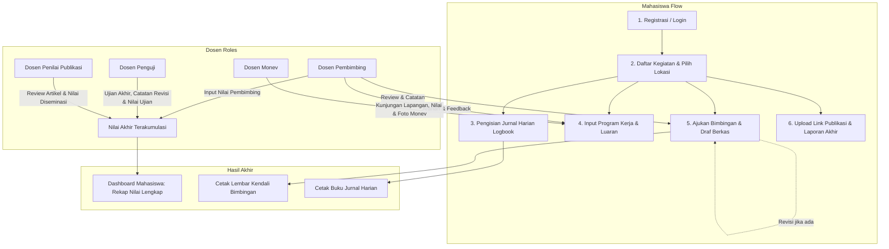

---

## 3. Panduan Lengkap untuk Mahasiswa

### 3.1 Registrasi Akun, Login, & Verifikasi
1. Buka alamat sistem pada web browser.
2. Klik tombol **Daftar** pada halaman login jika belum memiliki akun.
3. Isi formulir pendaftaran:
   - **NIM**, **Nama Lengkap**, **Program Studi** (PGSD, PBSI, PBI, SI, ME, PARBUD, HUKUM).
   - **Kampus**, **Kecamatan**, **Email Aktif**, dan **Password**.
   - Lampirkan link bukti **Pembayaran KRS** dan **KRS Aktif**.
4. Setelah mendaftar, akun Anda berstatus `Pending`. Tunggu verifikasi/persetujuan dari Administrator/Prodi sebelum login.
5. Jika akun sudah aktif, login menggunakan **NIM / Email** dan **Password** Anda.

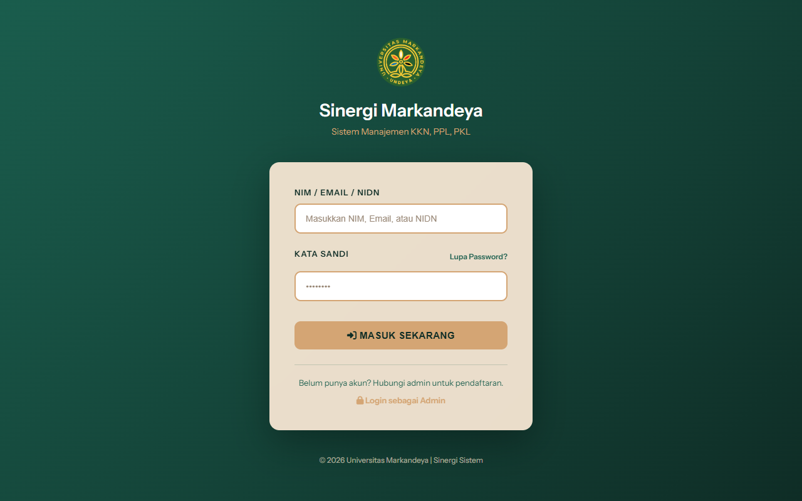
*Gambar 3.1 — Halaman Login Sinergi Markandeya*

> [!NOTE]
> Jika kampus Anda terhubung dengan sistem AIS (Academic Information System), data profil dapat disinkronkan secara otomatis saat Anda masuk ke sistem.

---

### 3.2 Dashboard Mahasiswa & Pemantauan Status
Setelah masuk ke dashboard, Anda dapat melihat informasi penting secara terpusat:
- **Kartu Identitas**: Nama, NIM, Program Studi, dan Kampus.
- **Status Kegiatan Aktif**: Jenis kegiatan (KKN/PPL/PKL/Magang), nama lokasi penempatan (Desa/Sekolah/Instansi).
- **Daftar Dosen & Pembimbing**: Menampilkan nama dan kontak Dosen Pembimbing, Dosen Penguji, dan Pembimbing Luar (jika ada).
- **Teman Se-Lokasi**: Daftar rekan mahasiswa yang berada dalam satu penempatan/kelompok.
- **Rekap Nilai Real-time**: Memantau perolehan nilai dari Dosen Pembimbing, Penguji, Pembimbing Luar, dan akumulasi Nilai Akhir.

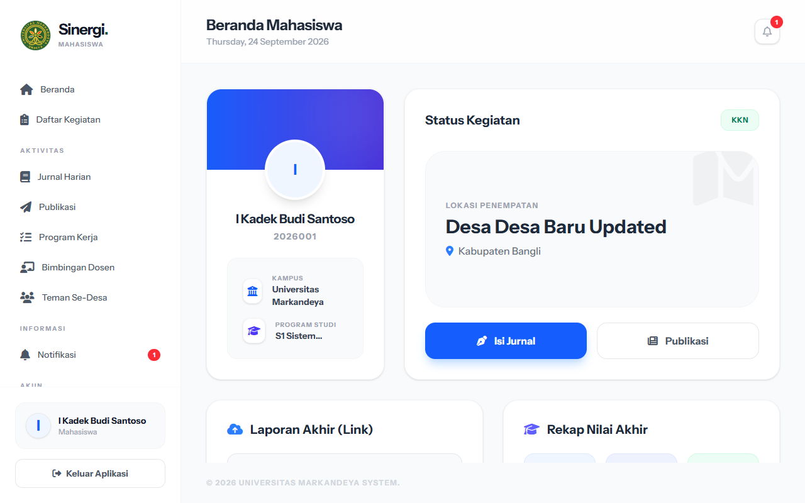
*Gambar 3.2 — Tampilan Dashboard Mahasiswa (Status Penempatan & Rekap Nilai)*

---

### 3.3 Pendaftaran Kegiatan & Pemilihan Lokasi (KKN, PPL, PKL, Magang)
1. Masuk ke menu **Daftar Kegiatan** (tersedia jika periode pendaftaran tahun akademik dibuka).
2. Pilih jenis kegiatan: **KKN**, **PPL**, **PKL**, atau **Magang**.
3. Pilih **Tahun Akademik** yang aktif.
4. Tentukan lokasi:
   - **KKN / PPL**: Pilih dari daftar lokasi desa/sekolah yang memiliki sisa kuota kapasitas.
   - **PKL / Magang**: Masukkan nama instansi pilihan, alamat instansi, bidang minat, skill, motivasi, serta link dokumen persyaratan (1, 2, dan 3).
5. Klik tombol **Daftar Sekarang**.
6. **Beralih/Switch Kegiatan**: Jika Anda memiliki lebih dari 1 kegiatan (misal KKN dan Magang di semester berbeda), gunakan tombol **Aktifkan** pada bagian *Riwayat Kegiatan* di Dashboard.

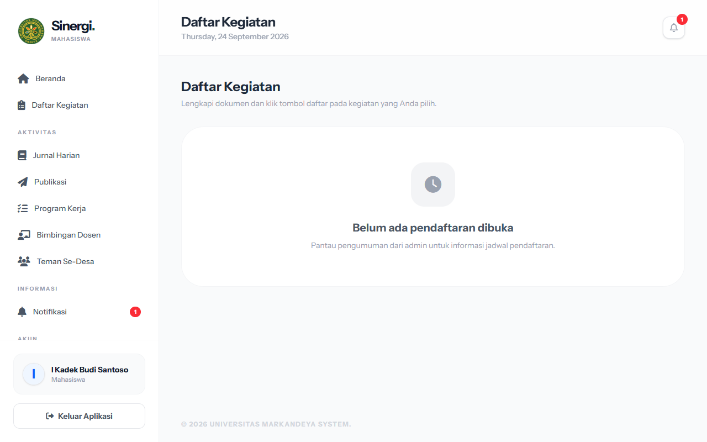
*Gambar 3.3 — Halaman Pendaftaran Kegiatan & Pemilihan Lokasi*

---

### 3.4 Pengisian Jurnal Harian (Logbook) & Cetak Rekap
Jurnal harian berfungsi mencatat setiap aktivitas pelaksanaan kegiatan di lapangan:
1. Klik menu **Jurnal Kegiatan** pada navigasi sisi kiri.
2. Klik tombol **+ Tambah Jurnal**.
3. Masukkan **Tanggal Kegiatan** dan deskripsikan secara rinci **Kegiatan yang Dilaksanakan**.
4. Klik **Simpan Jurnal**.
5. **Cetak Jurnal**: Klik tombol **Cetak Rekap Jurnal** di pojok kanan atas untuk mengunduh format lembar jurnal siap cetak yang menyertakan kolom tanda tangan Dosen Pembimbing.

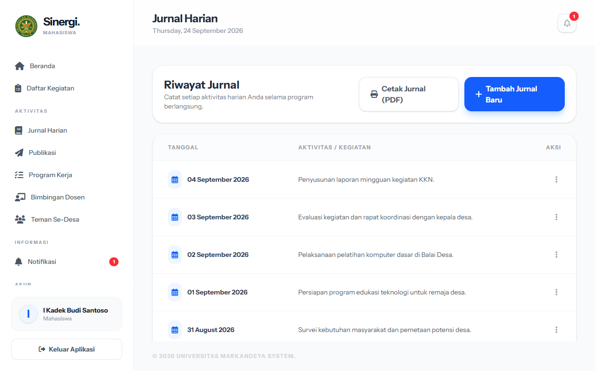
*Gambar 3.4 — Halaman Jurnal Harian (Logbook Kegiatan)*

---

### 3.5 Penyusunan Program Kerja & Bukti Luaran (Individu / Kelompok)
1. Klik menu **Program Kerja**.
2. Pilih tab **Program Kerja Individu** atau **Program Kerja Kelompok**:
   - Klik **+ Tambah Program Kerja**.
   - Isi **Judul Program**, **Deskripsi**, **Tujuan & Sasaran**, **Jadwal Pelaksanaan (Mulai - Selesai)**, dan **Estimasi Anggaran**.
   - Simpan data program kerja.
3. **Mengunggah Bukti Luaran**:
   - Buka detail program kerja yang telah dibuat.
   - Pada bagian luaran, klik **+ Tambah Luaran**.
   - Pilih jenis luaran (*Artikel Ilmiah, Video Kegiatan, Produk/Modul, Dokumen Laporan, Publikasi Media*), sertakan link Google Drive / URL video, dan deskripsi luaran.
4. **Melihat Arahan Pembimbing & Monev**:
   - Cek kolom **Catatan Pembimbing** untuk melihat arahan perbaikan.
   - Cek kolom **Hasil Monev** untuk melihat evaluasi serta foto monitoring kunjungan lapangan oleh Dosen Monev.

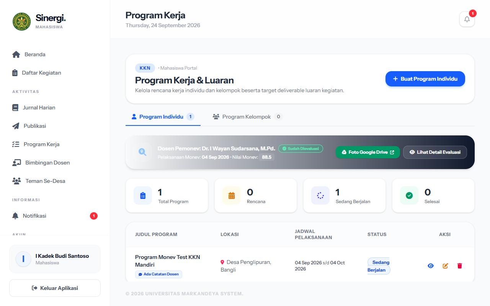
*Gambar 3.5 — Halaman Manajemen Program Kerja & Bukti Luaran Kegiatan*

---

### 3.6 Prosedur Bimbingan & Konsultasi Dosen Pembimbing
Sistem menyediakan modul pencatatan bimbingan resmi yang terhubung langsung dengan Dosen Pembimbing:
1. Klik menu **Bimbingan**.
2. Klik tombol **+ Ajukan Bimbingan**.
3. Isi data pengajuan:
   - **Topik / Bab**: Contoh: *Penyusunan Bab I & Instrumen Kegiatan*.
   - **Tanggal Bimbingan**: Tanggal pelaksanaan diskusi.
   - **Deskripsi Pokok Bahasan**: Uraikan pertanyaan, progres laporan, atau kendala yang dihadapi.
   - **Lampiran Berkas (Opsional)**: Unggah file draf dokumen laporan (PDF, DOCX, ZIP maksimal 10 MB).
4. Klik **Kirim Permohonan**.
5. **Status Bimbingan**:
   - 🟡 `Belum Direview`: Menunggu pengecekan dosen pembimbing.
   - 🔴 `Perlu Revisi`: Terdapat catatan revisi dari dosen pembimbing. Klik tombol **Edit / Kirim Revisi**, perbaiki catatan dan unggah draf perbaikan. Status otomatis kembali ke *Belum Direview*.
   - 🟢 `Disetujui (ACC)`: Dosen telah menyetujui materi bahasan tersebut.
6. **Cetak Kartu Bimbingan**: Jika seluruh sesi bimbingan telah terpenuhi, klik tombol **Cetak Lembar Bimbingan** untuk mencetak rekap konsultasi resmi ber-tanda tangan pembimbing.

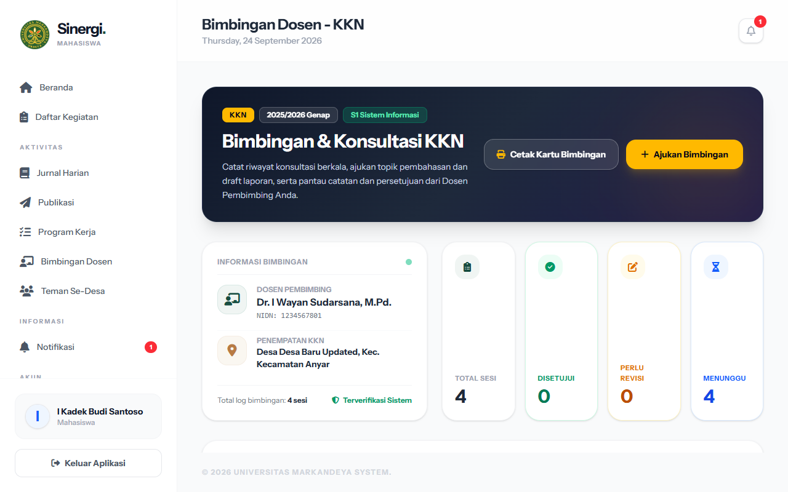
*Gambar 3.6 — Halaman Konsultasi & Riwayat Bimbingan Mahasiswa*

---

### 3.7 Pengunggahan Publikasi & Diseminasi Karya
1. Masuk ke menu **Publikasi**.
2. Klik tombol **+ Tambah Publikasi**.
3. Masukkan **Judul Publikasi / Artikel** dan **Link Publikasi** (URL Open Journal System, Berita Media Massa, atau Repositori).
4. Klik **Simpan**. Data ini akan otomatis masuk ke lembar penilaian Dosen Penilai Publikasi.

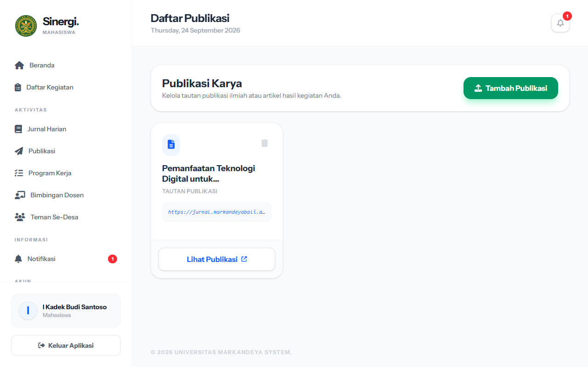
*Gambar 3.7 — Halaman Unggah Publikasi & Diseminasi Ilmiah*

---

### 3.8 Unggah Laporan Akhir & Pengecekan Nilai Akhir
1. Pada **Dashboard Mahasiswa**, cari kotak **Laporan Akhir (Link)**.
2. Tempelkan URL Google Drive / Dropbox laporan akhir lengkap yang dapat diakses publik/dosen.
3. Klik **Simpan Link Laporan**.
4. Cek kotak **Rekap Nilai Akhir** untuk melihat nilai yang telah diinput oleh dosen pembimbing, penguji, dan pembimbing luar secara transparan.

---

## 4. Panduan Lengkap untuk Dosen

Dosen dapat mengampu satu atau lebih peran sekaligus sesuai penugasan dari program studi. Menu dosen diakses melalui portal `/dosen-pembimbing/dashboard`.

---

### 4.1 Login & Dashboard Utama Dosen
1. Masuk ke sistem menggunakan kredensial akun Dosen (**NIDN** dan **Password**).
2. Di Dashboard Dosen, terdapat statistik ringkasan:
   - Total Mahasiswa Bimbingan aktif (per kegiatan: KKN, PPL, PKL, Magang).
   - Total Mahasiswa Ujian yang diuji.
   - Jumlah mahasiswa yang sudah dinilai vs belum dinilai.
   - Filter Tahun Akademik aktif.

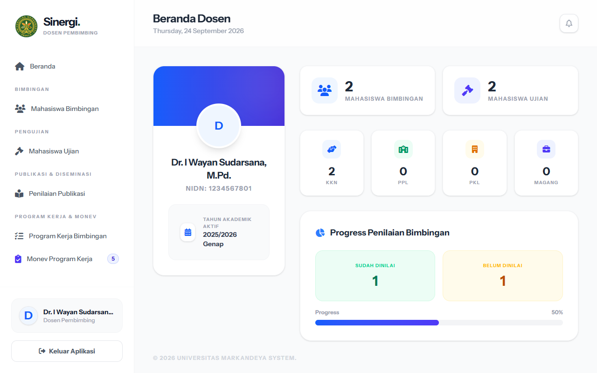
*Gambar 4.1 — Tampilan Dashboard Utama Dosen Pembimbing & Penguji*

---

### 4.2 Peran Dosen Pembimbing: Review Bimbingan, Proker, & Input Nilai

#### A. Review Permohonan Bimbingan Mahasiswa
1. Masuk ke menu **Daftar Bimbingan** (`dosen.bimbingan`).
2. Pilih Tahun Akademik atau filter kegiatan.
3. Klik nama mahasiswa untuk membuka halaman **Detail Mahasiswa**.
4. Pada tab **Riwayat Bimbingan**:
   - Periksa topik, tanggal, deskripsi, dan unduh berkas lampiran draf laporan mahasiswa.
   - Isi form **Catatan / Masukan Dosen**.
   - Pilih status:
     - `Disetujui`: Jika materi sudah selesai dan memenuhi standar.
     - `Perlu Revisi`: Jika mahasiswa perlu melakukan perbaikan draf.
   - Klik **Simpan Review**. Mahasiswa akan menerima notifikasi otomatis.

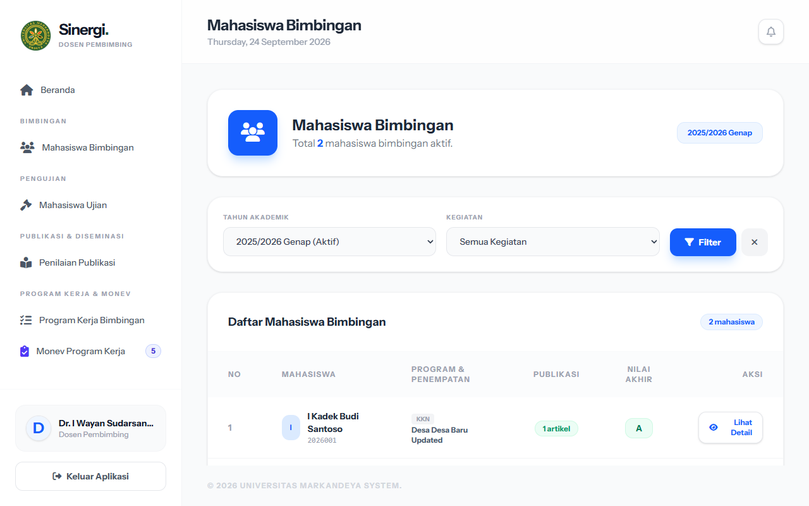
*Gambar 4.2a — Daftar Mahasiswa Bimbingan Dosen*

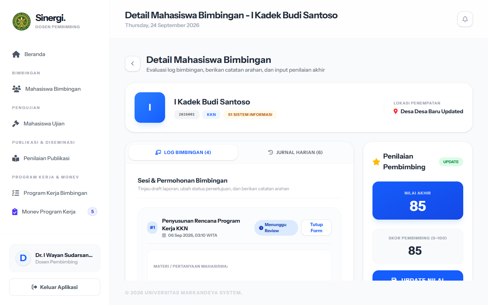
*Gambar 4.2b — Detail Riwayat Bimbingan Mahasiswa & Form Catatan Dosen*

#### B. Monitoring Program Kerja & Memberikan Arahan
1. Masuk ke menu **Program Kerja > Mahasiswa Bimbingan** atau **Semua Program**.
2. Klik nama mahasiswa untuk melihat daftar Program Kerja Individu dan Kelompok beserta bukti luarannya.
3. Tuliskan arahan pada kolom **Catatan Dosen Pembimbing** dan ubah status program kerja (Rencana / Sedang Berjalan / Selesai / Tunda).
4. Klik **Simpan Catatan**.

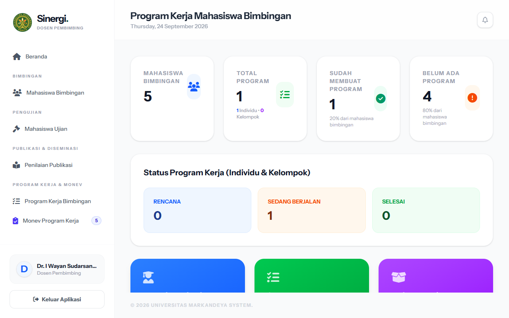
*Gambar 4.2c — Halaman Monitoring Program Kerja Mahasiswa Bimbingan*

#### C. Input Nilai Pembimbing
1. Buka halaman **Detail Mahasiswa**.
2. Pada panel **Input Nilai Pembimbing**:
   - Untuk **KKN / PPL**: Masukkan nilai akumulatif bimbingan (skala 0 - 100).
   - Untuk **PKL / Magang**: Masukkan nilai per aspek rubrik:
     * Nilai Laporan (Bobot 15)
     * Nilai Relevansi Bidang (Bobot 10)
     * Nilai Presentasi/Pelaksanaan (Bobot 15)
     * *(Sistem otomatis mengalkulasi nilai akhir pembimbing)*.
3. Klik tombol **Simpan Nilai**.

---

### 4.3 Peran Dosen Penguji: Penilaian Ujian Akhir & Catatan Revisi
1. Klik menu **Ujian Mahasiswa** (`dosen.ujian.index`).
2. Tinjau daftar mahasiswa yang dijadwalkan untuk diuji pada periode tahun akademik terkait.
3. Klik tombol **Uji / Detail** pada mahasiswa target:
   - Anda dapat memeriksa rekap logbook kegiatan, riwayat bimbingan pembimbing, artikel publikasi, serta link dokumen laporan mahasiswa.
4. Pada panel **Formulir Penilaian Ujian**:
   - **Untuk Mahasiswa PPL**:
     * Masukkan **Nilai Ujian Laporan** (0 - 100).
     * Isi **Catatan / Revisi Ujian** (poin-poin revisi naskah).
   - **Untuk Mahasiswa KKN / PKL / Magang**:
     * Masukkan nilai aspek:
       1. Program Kerja (`Prog`)
       2. Kontribusi Lapangan (`Kont`)
       3. Kerjasama Tim (`Tim`)
       4. Kreativitas & Inovasi (`Kreat`)
       5. Etika & Partisipasi (`Etika`)
     * Masukkan **Catatan / Revisi Ujian**.
5. Klik **Simpan Nilai Ujian**. Nilai rata-rata dan catatan revisi ujian akan langsung terkirim dan tampil di dashboard mahasiswa.

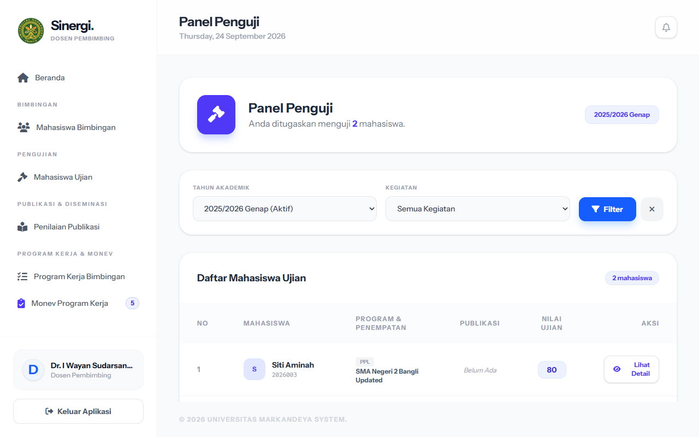
*Gambar 4.3 — Halaman Penilaian Ujian Akhir oleh Dosen Penguji*

---

### 4.4 Peran Dosen Penilai Publikasi: Evaluasi Diseminasi Ilmiah
1. Klik menu **Penilaian Publikasi** (`dosen.publikasi.index`).
2. Pilih mahasiswa yang mengajukan artikel/publikasi ilmiah.
3. Buka tautan artikel publikasi mahasiswa untuk membaca naskah/media publikasi.
4. Input skor penilaian (skala 0 - 100) pada 5 indikator standar:
   - **Ketercapaian Target Publikasi**
   - **Sistematika Penulisan & Kaidah Ilmiah**
   - **Kelayakan Konten & Manfaat Pengabdian/Penelitian**
   - **Kualitas Presentasi / Media Publikasi**
   - **Kemampuan Mempertahankan Gagasan**
5. Klik **Simpan Nilai Publikasi**. Nilai rata-rata otomatis terkalkulasi.

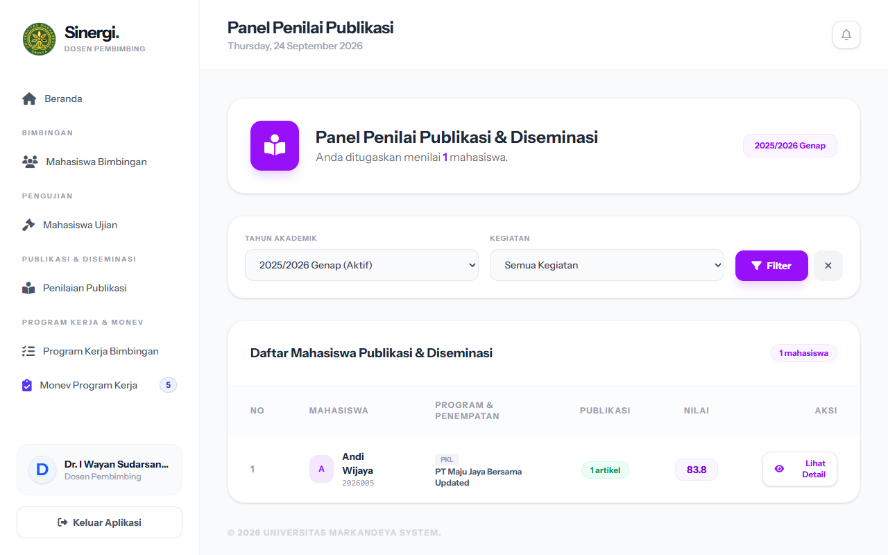
*Gambar 4.4 — Halaman Evaluasi & Penilaian Publikasi Ilmiah Mahasiswa*

---

### 4.5 Peran Dosen Monev: Monitoring Lapangan, Unggah Foto & Nilai Monev
Dosen Monev bertugas memvalidasi keterlaksanaan kegiatan dan program kerja langsung di lokasi penempatan:
1. Klik menu **Monev Program Kerja** (`dosen.program-kerja.monev-dashboard`).
2. Sistem menyajikan daftar tugas Monev berdasarkan lokasi kelompok atau program kerja individu mahasiswa.
3. Klik tombol **Lakukan Monev / Detail**:
   - Tinjau deskripsi proker, jadwal, dan progres luaran mahasiswa di lokasi tersebut.
4. Pada **Form Hasil Monitoring & Evaluasi**:
   - Tentukan **Tanggal Kunjungan Monev**.
   - Masukkan **Nilai Monev Lapangan** (skala 0 - 100).
   - Tuliskan **Catatan Evaluasi Lapangan / Rekomendasi Monev**.
   - Lampirkan **Link Google Drive / Dokumentasi Eksternal** (jika ada video/dokumen pendukung).
   - **Unggah Foto Dokumentasi Lapangan**: Pilih satu atau beberapa file foto kunjungan monev bersama mahasiswa/mitra (format JPG/PNG/WEBP).
5. Klik **Simpan Hasil Monev**.
6. Anda dapat menghapus foto yang salah melalui ikon tempat sampah pada pratinjau galeri foto monev.

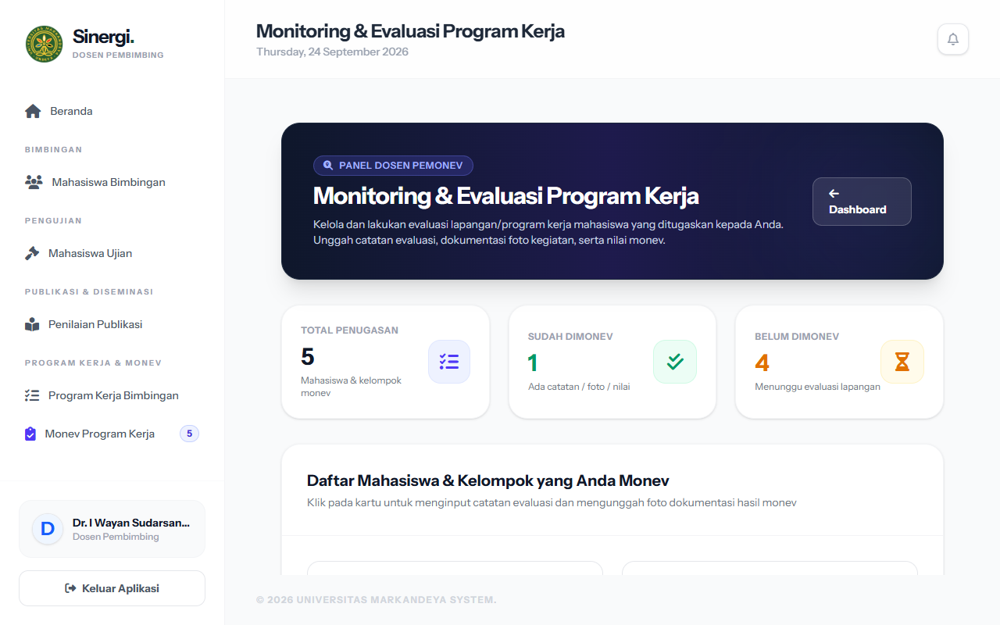
*Gambar 4.5 — Halaman Monitoring & Evaluasi (Monev) Lapangan & Galeri Foto*

---

## 5. Tabel Matriks Hak Akses & Matriks Rubrik Penilaian

### 📊 Matriks Hak Akses Fitur
| Fitur / Modul | Mahasiswa | Dosen Pembimbing | Dosen Penguji | Dosen Penilai Publikasi | Dosen Monev |
| :--- | :---: | :---: | :---: | :---: | :---: |
| Pendaftaran & Pilih Lokasi | ✅ Input | ❌ | ❌ | ❌ | ❌ |
| Jurnal Harian (Logbook) | ✅ Buat & Cetak | 👁️ Monitoring | 👁️ Monitoring | ❌ | ❌ |
| Program Kerja & Luaran | ✅ Buat & Unggah | 💬 Beri Catatan | 👁️ Monitoring | ❌ | 📝 Evaluasi & Foto |
| Konsultasi Bimbingan | ✅ Ajukan & Cetak | ✅ Review & ACC | 👁️ Monitoring | ❌ | ❌ |
| Unggah Publikasi | ✅ Input Link | 👁️ Monitoring | 👁️ Monitoring | ✅ Nilai 5 Aspek | ❌ |
| Penilaian Ujian Akhir | 👁️ Lihat Hasil | ❌ | ✅ Nilai + Revisi | ❌ | ❌ |
| Penilaian Pembimbing | 👁️ Lihat Hasil | ✅ Input Nilai | ❌ | ❌ | ❌ |
| Unggah Laporan Akhir | ✅ Input Link | 👁️ Akses Link | 👁️ Akses Link | 👁️ Akses Link | ❌ |

---

### 📋 Komponen & Rumus Perhitungan Penilaian

```
+-----------------------------------------------------------------------------------+
| 1. NILAI PEMBIMBING (PKL / Magang):                                              |
|    Nilai = (Laporan x 15 + Relevansi x 10 + Presentasi x 15) / 40                |
+-----------------------------------------------------------------------------------+
| 2. NILAI UJIAN (KKN / PKL / Magang):                                             |
|    Nilai = (Prog + Kont + Tim + Kreat + Etika) / 5                                |
|    *Untuk PPL: Nilai Ujian Laporan tunggal (0 - 100)                             |
+-----------------------------------------------------------------------------------+
| 3. NILAI PUBLIKASI:                                                               |
|    Nilai = (Ketercapaian + Sistematika + Kelayakan + Presentasi + Pertahankan) / 5|
+-----------------------------------------------------------------------------------+
| 4. NILAI AKHIR MAHASISWA:                                                         |
|    Akumulasi terbobot dari Nilai Pembimbing, Nilai Penguji, & Pembimbing Luar     |
+-----------------------------------------------------------------------------------+
```

---

## 6. Tanya Jawab & Penyelesaian Masalah (FAQ)

**Q1: Mengapa mahasiswa tidak bisa mendaftar kegiatan di menu Daftar Kegiatan?**
> **Jawaban:** Pastikan tanggal hari ini berada dalam rentang `tanggal_mulai_daftar` dan `tanggal_selesai_daftar` pada Tahun Akademik yang aktif yang dikelola oleh Administrator.

**Q2: Mengapa dosen tidak dapat me-review bimbingan mahasiswa tertentu?**
> **Jawaban:** Pastikan Administrator telah melakukan *Assign / Plotting Dosen Pembimbing* terhadap NIM mahasiswa yang bersangkutan.

**Q3: Bagaimana jika mahasiswa mendapat status "Perlu Revisi" saat bimbingan?**
> **Jawaban:** Mahasiswa cukup masuk ke detail bimbingan tersebut, klik **Edit**, perbaiki catatan atau lampirkan berkas naskah revisi baru, lalu klik simpan. Status otomatis berubah menjadi *Belum Direview* agar dosen pembimbing memeriksa kembali.

**Q4: Apakah foto monev yang diunggah oleh Dosen Monev bisa dilihat oleh mahasiswa?**
> **Jawaban:** Ya, catatan evaluasi dan dokumentasi monev secara otomatis ditampilkan pada kartu monitoring program kerja mahasiswa untuk transparansi bimbingan lapangan.

**Q5: Bagaimana cara mencetak lembar kendali bimbingan atau jurnal harian?**
> **Jawaban:** Klik tombol **Cetak** pada halaman riwayat Bimbingan (`/bimbingan/cetak`) atau Jurnal (`/jurnal/cetak`). Browser akan membuka tampilan lembar resmi yang siap dicetak fisik maupun disimpan sebagai PDF.

---
*Dokumen Panduan Sistem Sinergi Markandeya © 2026 - Pusat Teknologi Informasi & Komunikasi / Lembaga Penjaminan Mutu*
*Universitas Markandeya*
